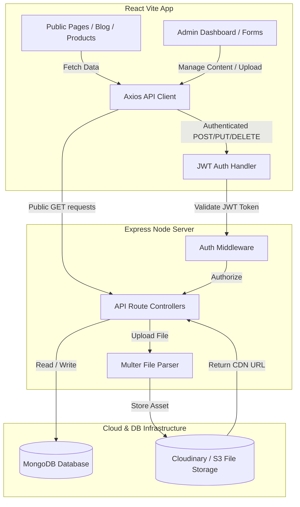

# End-to-End Backend Architecture & API Specification

This document details the complete backend design, database tables/collections, relations, and API endpoints required to transition the static Drone project into a dynamic system managed by an Admin Panel.

---

## 🛠️ Tech Stack Overview

- **Server Environment:** Node.js with Express.js framework.
- **Primary Database Choice (Recommended):** **MongoDB (NoSQL)** using Mongoose ODM. This is recommended because drone specifications, missions, and galleries utilize complex nested structures (like arrays of key-value pairs or strings) which map naturally to JSON documents without requiring excessive table joins.
- **Alternative Database Choice:** **PostgreSQL or MySQL (SQL)**. If a relational database is required, data normalization with foreign keys or JSONB columns will be used.
- **Authentication:** JWT (JSON Web Tokens) with passwords hashed using bcrypt.
- **Media Uploads:** Multer middleware with storage hosted on Cloudinary or AWS S3 (for image assets and `.glb` 3D model files).

---

## 🗄️ Database Schema Design

### 1. Drones Schema (`drones`)

Stores the technical data, media, and 3D models of the drones.

#### MongoDB Collection: `drones`
- `_id`: ObjectId (Primary Key)
- `serial`: String (Unique)
- `name`: String
- `use`: String (Short description of usage)
- `image`: String (URL to main image)
- `gallery`: Array of Strings (URLs to gallery images)
- `model`: String (URL to `.glb` 3D model)
- `specs`: Array of Objects:
  - `key`: String (e.g., "Endurance")
  - `value`: String (e.g., "12 min")
- `missions`: Array of Strings (e.g., `["Training", "Surveillance"]`)
- `createdAt`: Date

#### SQL Tables (Normalized)
- **`drones`**: `id` (INT PK AutoIncrement), `serial` (VARCHAR Unique), `name` (VARCHAR), `use` (TEXT), `image_url` (VARCHAR), `model_url` (VARCHAR), `created_at` (TIMESTAMP).
- **`drone_specs`**: `id` (INT PK), `drone_id` (INT FK referencing `drones.id` ON DELETE CASCADE), `spec_key` (VARCHAR), `spec_value` (VARCHAR).
- **`drone_gallery`**: `id` (INT PK), `drone_id` (INT FK referencing `drones.id` ON DELETE CASCADE), `image_url` (VARCHAR).
- **`drone_missions`**: `id` (INT PK), `drone_id` (INT FK referencing `drones.id` ON DELETE CASCADE), `mission_name` (VARCHAR).

---

### 2. Drone Parts Schema (`drone_parts`)

Stores information about spare parts like motors, propellers, and flight controllers.

#### MongoDB Collection: `drone_parts`
- `_id`: ObjectId (PK)
- `name`: String
- `category`: String (e.g., "Propulsion", "Battery & Charger", "Remote Controller")
- `image`: String (URL to image)
- `specs`: Array of Objects:
  - `key`: String
  - `value`: String

#### SQL Tables (Normalized)
- **`drone_parts`**: `id` (INT PK), `name` (VARCHAR), `category` (VARCHAR), `image_url` (VARCHAR).
- **`part_specs`**: `id` (INT PK), `part_id` (INT FK referencing `drone_parts.id` ON DELETE CASCADE), `spec_key` (VARCHAR), `spec_value` (VARCHAR).

---

### 3. Inside Kits Schema (`inside_kits`)

Stores the training and development kits details.

#### MongoDB Collection: `inside_kits`
- `_id`: ObjectId (PK)
- `name`: String
- `category`: String (e.g., "UAV Training", "Development Kit")
- `image`: String (URL)
- `price`: String (e.g., "Get a Quote" or numerical value)
- `specs`: Array of Objects:
  - `key`: String
  - `value`: String

#### SQL Tables (Normalized)
- **`inside_kits`**: `id` (INT PK), `name` (VARCHAR), `category` (VARCHAR), `image_url` (VARCHAR), `price` (VARCHAR).
- **`kit_specs`**: `id` (INT PK), `kit_id` (INT FK referencing `inside_kits.id` ON DELETE CASCADE), `spec_key` (VARCHAR), `spec_value` (VARCHAR).

---

### 4. Global Gallery Schema (`gallery`)

Manages the home page landing gallery images.

#### MongoDB Collection / SQL Table: `gallery`
- `_id` / `id`: PK
- `src`: String (URL of image)
- `caption`: String (Description of the image)

---

### 5. Blogs Schema (`blogs`)

Manages the articles and insights section.

#### MongoDB Collection / SQL Table: `blogs`
- `_id` / `id`: PK
- `slug`: String (Unique - URL slug like `make-in-india-uav-ecosystem`)
- `tag`: String (e.g., "Industry Intel")
- `date`: String / Date (Publication date)
- `title`: String
- `desc`: String (Short summary)
- `content`: Text (Complete rich text content of the blog post)
- `image`: String (URL to banner image)

---

### 6. Contact Inquiries Schema (`inquiries`)

Captures secure messages sent by clients through the Contact form.

#### MongoDB Collection / SQL Table: `inquiries`
- `_id` / `id`: PK
- `name`: String
- `org`: String (Organization name)
- `email`: String
- `phone`: String
- `mission`: String (e.g., "Survey & Mapping", "Agriculture")
- `message`: Text
- `status`: String (Enum: `["Pending", "In Progress", "Resolved"]`, Default: `"Pending"`)
- `createdAt`: Date / Timestamp

---

### 7. Admin Authentication Schema (`admins`)

Used for protecting backend write-operations and authorizing login to the Admin Panel dashboard.

#### MongoDB Collection / SQL Table: `admins`
- `_id` / `id`: PK
- `username`: String (Unique)
- `password`: String (Bcrypt hashed password)
- `role`: String (Default: `"admin"`)

---

## 🔌 API Endpoints Specifications

### 🔐 1. Authentication
- `POST /api/auth/login`
  - **Description:** Log in to the Admin Panel.
  - **Payload:** `{ "username": "...", "password": "..." }`
  - **Response:** JWT token & admin user details.
- `POST /api/auth/register` (Internal/Protected)
  - **Description:** Register a new admin user.
- `GET /api/auth/me` (Protected)
  - **Description:** Check JWT validation status.

### 🛸 2. Drones Management
- `GET /api/drones` ➡️ Retrieves all drones (Public).
- `GET /api/drones/:id` ➡️ Retrieves a single drone by ID (Public).
- `POST /api/drones` (Protected) ➡️ Creates a new drone.
- `PUT /api/drones/:id` (Protected) ➡️ Updates drone specs, images, or files.
- `DELETE /api/drones/:id` (Protected) ➡️ Deletes a drone.

### ⚙️ 3. Drone Parts
- `GET /api/parts` ➡️ Retrieves all spare parts (Public).
- `POST /api/parts` (Protected) ➡️ Adds a new spare part.
- `PUT /api/parts/:id` (Protected) ➡️ Updates a part's details.
- `DELETE /api/parts/:id` (Protected) ➡️ Removes a part.

### 📦 4. Training Kits
- `GET /api/kits` ➡️ Retrieves all learning kits (Public).
- `POST /api/kits` (Protected) ➡️ Adds a new kit.
- `PUT /api/kits/:id` (Protected) ➡️ Updates kit details.
- `DELETE /api/kits/:id` (Protected) ➡️ Removes a kit.

### 🖼️ 5. Gallery & Carousels
- `GET /api/gallery` ➡️ List homepage gallery images (Public).
- `POST /api/gallery` (Protected) ➡️ Upload and add image to gallery.
- `DELETE /api/gallery/:id` (Protected) ➡️ Delete gallery image.

### 📝 6. Blogs
- `GET /api/blogs` ➡️ Retrieves all blog posts (Public).
- `GET /api/blogs/:slug` ➡️ Retrieves a blog post by its URL slug (Public).
- `POST /api/blogs` (Protected) ➡️ Creates a new blog post.
- `PUT /api/blogs/:id` (Protected) ➡️ Updates a blog post.
- `DELETE /api/blogs/:id` (Protected) ➡️ Deletes a blog post.

### 📩 7. Inquiries
- `POST /api/inquiries` ➡️ Submit form inquiry (Public).
- `GET /api/inquiries` (Protected) ➡️ Retrieve all inquiry forms (Admin dashboard).
- `PUT /api/inquiries/:id` (Protected) ➡️ Update inquiry status (`Pending` -> `Resolved`).

### 📤 8. Media Upload Controller
- `POST /api/upload` (Protected)
  - **Headers:** Content-Type: `multipart/form-data`
  - **Body:** `{ "file": File }`
  - **Description:** Uploads images (`.webp`, `.png`) or 3D models (`.glb`) to Cloudinary/AWS S3 and returns a secure CDN URL.

---

## 💻 End-to-End Migration Flow

---

## 📈 Database Relationships Matrix
- **Admin**: Independent entity.
- **Inquiries**: Independent entity recording visitor feedback.
- **Gallery**: Independent list of assets.
- **Blogs**: Independent entries mapped by their URL slug.
- **Drones**: Connected directly to sub-items. In MongoDB, specifications (`specs` array of sub-documents) are embedded inside the parent `drones` document. In SQL databases, this is normalized using a `drone_id` foreign key referencing `drones.id`.
